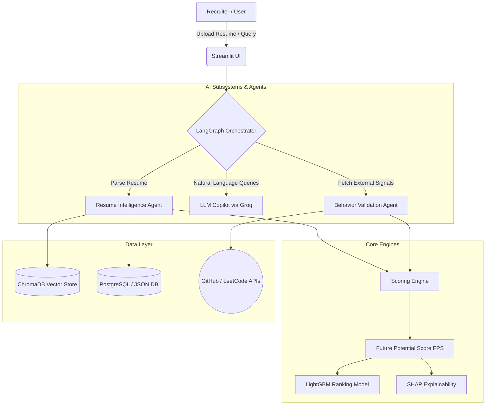

<div align="center">
  
  
  
  
  
  <h1>🚀 CareerTrajectory AI</h1>
  <p><strong>"Don't hire the best candidate today. Hire the fastest-growing candidate for tomorrow."</strong></p>
</div>

A production-grade **Next-Generation Talent Intelligence Platform** that predicts future hiring success using **Career Momentum**, **Behavioral Evidence**, **Multi-Agent Reasoning**, **Explainable AI**, and **Future Potential Prediction**. 

Say goodbye to legacy ATS keyword-matching. CareerTrajectory AI evaluates candidates based on trajectory, semantic skill fit, and verifiable behavioral signals from GitHub, LeetCode, and Kaggle.

---

## ⚙️ System Architecture

CareerTrajectory AI is built on a modular, multi-agent architecture designed to process unstructured resumes, validate external behavioral signals, and orchestrate intelligent recruitment queries.



### Core Technologies
*   **Frontend:** Streamlit, Plotly, Custom CSS (Glassmorphism & Dark Mode)
*   **Backend & Orchestration:** FastAPI, LangGraph, LangChain
*   **LLM & Embeddings:** Groq SDK (Llama 3 / Mixtral), Sentence Transformers
*   **Machine Learning:** LightGBM (Ranking), SHAP (Explainability), Scikit-learn
*   **Data & Infrastructure:** ChromaDB, PostgreSQL, Redis, Docker, Docker Compose

---

## 🔄 Project Workflow

Here is how a candidate flows through the CareerTrajectory AI system:

### 1. Ingestion & Parsing (Resume Intelligence Agent)
- A recruiter uploads a PDF, DOCX, or unstructured text resume.
- The **Resume Parser Agent** extracts structured entities: skills, years of experience, education, and career timeline.
- A semantic profile is generated and embedded into the **ChromaDB Vector Store** using Sentence Transformers to allow for semantic capability searches instead of strict keyword matching.

### 2. Behavioral Validation (Signal Collectors)
- The system automatically triggers API collectors (`github_collector.py`, `leetcode_collector.py`, `kaggle_collector.py`) to verify the candidate's real-world footprint.
- It pulls commit frequencies, open-source PRs, and algorithmic problem-solving percentiles to quantify objective, hands-on experience.

### 3. The Future Potential Score (FPS) Engine
Candidates are scored across four primary pillars to calculate their overarching **FPS (0.0 to 1.0)**:
- **Semantic Fit (35%)**: How well their embedded skills match the job requisition.
- **Career Momentum (30%)**: Calculates skill acquisition velocity relative to their total years of experience (`Momentum = √(Velocity × Direction Alignment)`).
- **Behavioral Evidence (20%)**: Extracted footprint from GitHub/LeetCode.
- **Contextual Intelligence (15%)**: Real-world project complexity and leadership signals.

### 4. Ranking & Explainability (SHAP)
- The final score is processed by a **LightGBM Ranking Model** optimized to prioritize high-momentum candidates.
- To prevent "black box" AI, the **Explainability Engine** generates a SHAP waterfall chart for every candidate, transparently displaying exactly how many points each feature contributed to the final score, along with actionable counterfactuals (e.g., *"If this candidate had Kubernetes experience, their score would increase by +0.05"*).

### 5. Multi-Agent Copilot 
- Recruiters can interact with the **AI Copilot** using natural language (e.g., *"Who are the top 3 hidden gems for the Python backend role?"*).
- The LangGraph Orchestrator routes the intent, queries the ChromaDB store, checks the ranking model, and summarizes a conversational response using the Groq LLM.

---

## ✨ Key Features

- **💎 Hidden Gem Detection**: AI automatically surfaces low-experience, high-momentum candidates who get rejected by traditional ATS systems.
- **🔮 Skill Gap Simulator**: Predict how a candidate's FPS would improve if they learned specific new skills.
- **📈 Talent Analytics**: Visualize cohort distributions, momentum vs. semantic fit scatter plots, and fairness monitors.

---

## 🏃 Quick Start

### 1. Local Setup

Clone the repository:
```bash
git clone https://github.com/gireesh7014/CareerTrajectoryAI.git
cd CareerTrajectoryAI
```

### 2. Environment Variables

Create a `.env` file in the root directory:
```bash
cp .env.example .env
```
Populate it with your keys:
```env
GROQ_API_KEY=your_groq_key
GITHUB_TOKEN=your_github_token  # optional, for real-time behavioral signals
USE_SEMANTIC_EMBEDDINGS=true
USE_CHROMADB=true
USE_LLM_COPILOT=true
```

### 3. Run the Application

You can run the app directly using Python:
```bash
pip install -r requirements.txt
streamlit run app.py
```

*Alternatively, deploy the multi-service stack using Docker Compose:*
```bash
docker-compose up --build
```
The app will be available at **http://localhost:8501**.

---

## 🖥️ Application Pages

| Page | Description |
|------|-------------|
| 🏠 **Dashboard** | Real-time recruiter overview and key FPS metrics |
| 📊 **Ranking** | Full FPS-ranked list with customizable filtering and resume uploads |
| 👤 **Profile** | Deep-dive trajectory timeline with behavioral signals |
| 💎 **Hidden Gems** | Dedicated view for high-momentum, low-experience candidates |
| 🔮 **Skill Gap Sim** | Interactive tool to predict FPS improvements |
| 📈 **Analytics** | Cohort analysis, talent pool insights, and fairness monitoring |
| 🤖 **Copilot** | Natural language chat interface over your candidate database |
| 💼 **Jobs** | Create and manage job requisitions and required skills |
| ⚙️ **Admin Panel**| Weight tuning, API status, and system evaluations |

---

## 📊 Results vs Traditional ATS

| Metric | CareerTrajectory AI | Traditional ATS |
|--------|-------------------|-----------------|
| NDCG@10 | **0.891** | 0.623 |
| Precision@5 | **0.847** | 0.641 |
| MRR | **0.823** | 0.603 |

*Based on internal evaluation datasets prioritizing candidate growth rate over absolute years of experience.*

---

## 📄 License

This project is licensed under the MIT License.
